# TaskFlow Lite - Architecture Diagrams

## 📊 Visual Architecture Overview

This document contains visual representations of the TaskFlow Lite architecture, including component diagrams, data flow charts, and interaction patterns.

---

## 🏗️ System Architecture Diagram

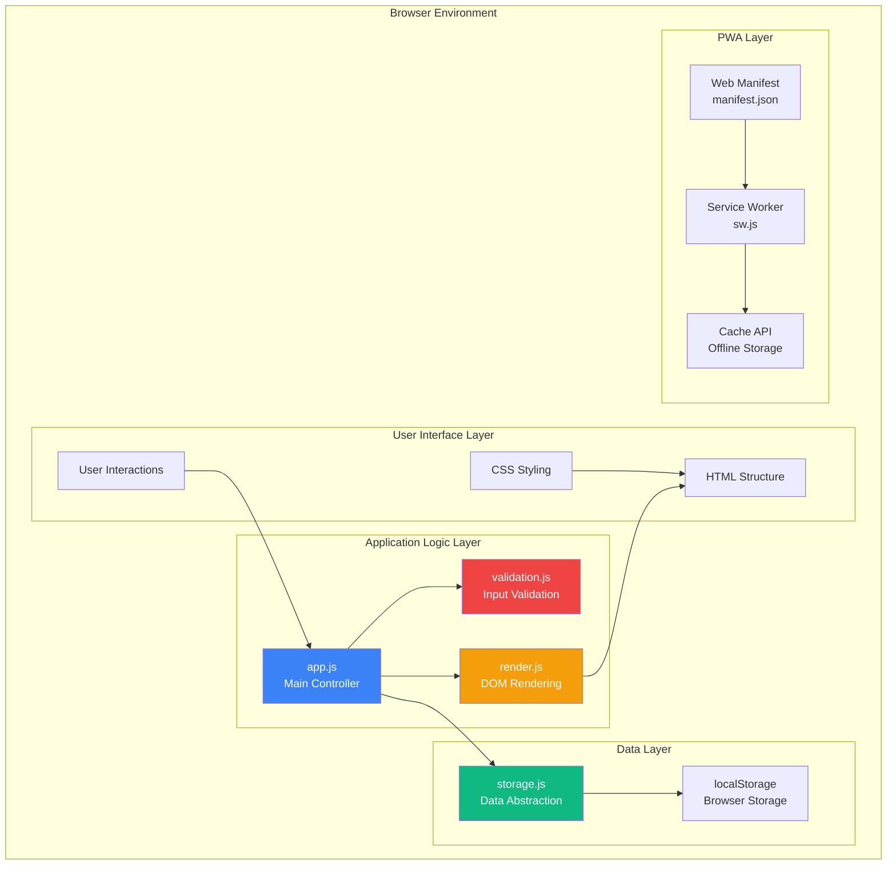

---

## 🔄 Data Flow Architecture

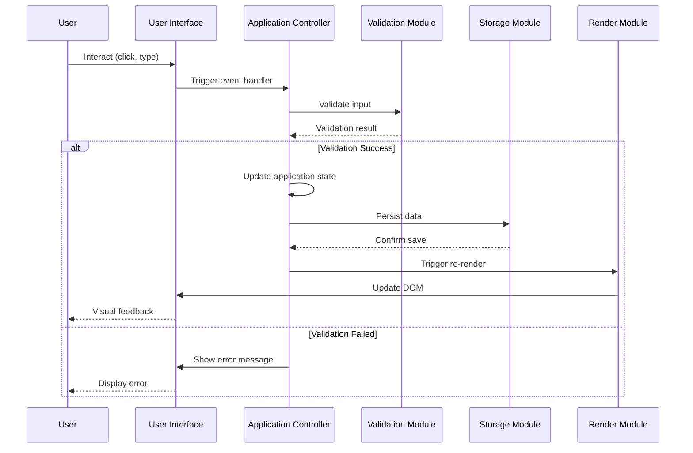

---

## 📦 Module Dependency Graph

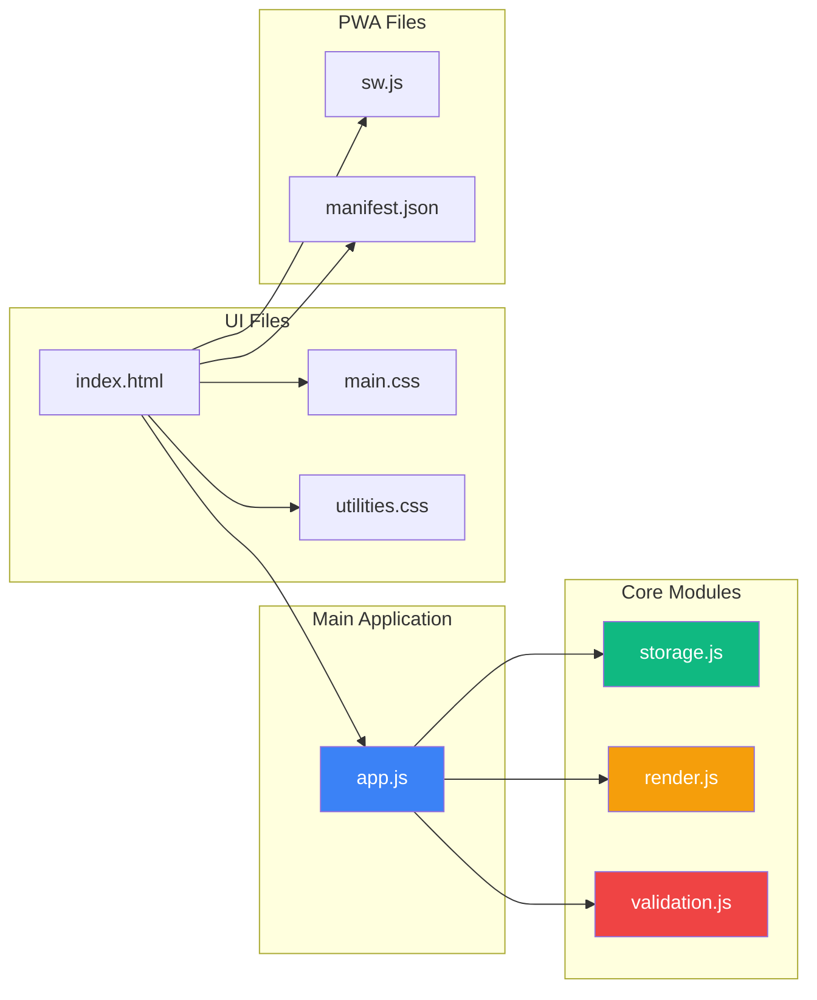

---

## 🎯 Event Flow Diagrams

### Task Creation Event Flow

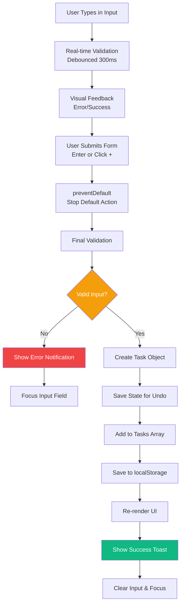

### Task Interaction Event Flow

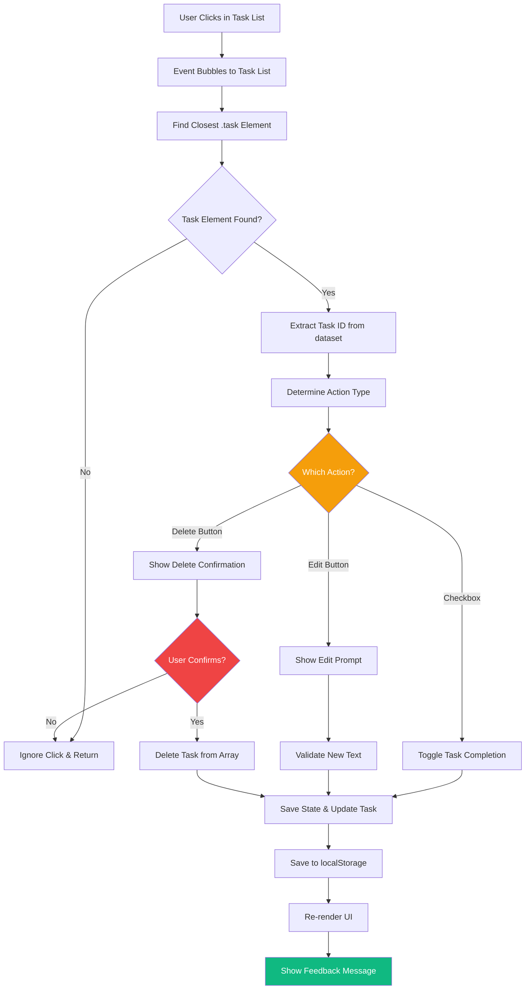

---

## 🗄️ localStorage Schema Diagram

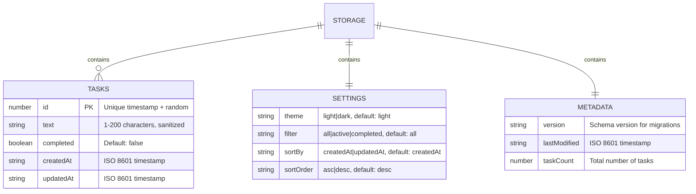

---

## ⚡ Performance Architecture

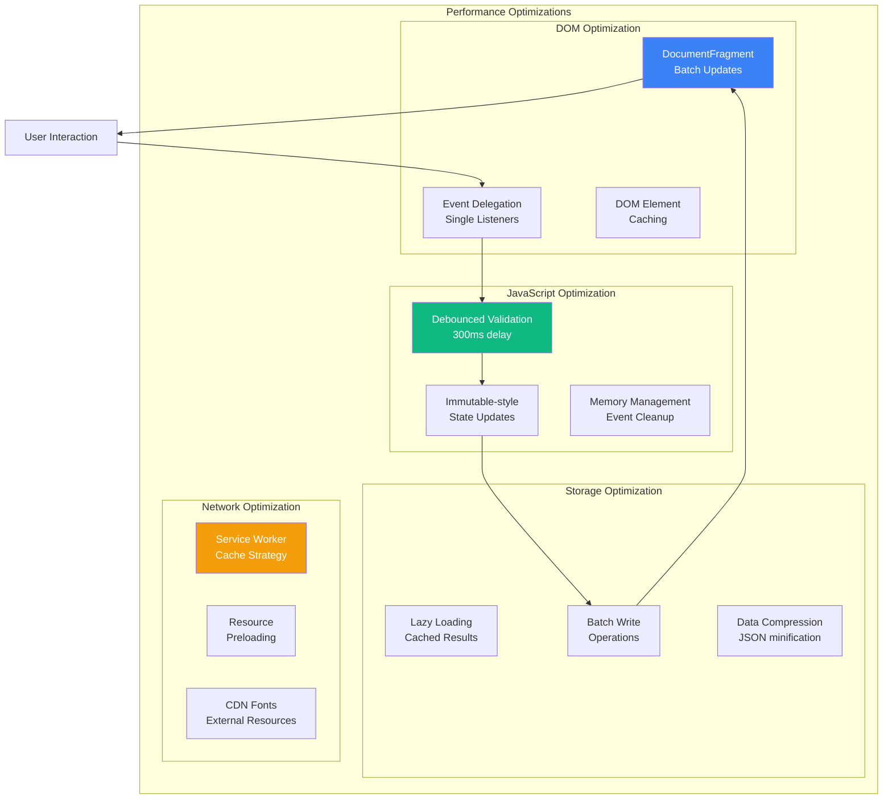

---

## 🔒 Security Architecture

```mermaid
flowchart TD
    INPUT[User Input] --> VALIDATE[Input Validation]
    VALIDATE --> LENGTH{Length Check<br/>≤ 200 chars}
    
    LENGTH -->|Fail| REJECT[Reject Input]
    LENGTH -->|Pass| CHARS{Character Filter<br/>Allowed chars only}
    
    CHARS -->|Fail| REJECT
    CHARS -->|Pass| ESCAPE[HTML Escaping<br/>&, <, >, ", ']
    
    ESCAPE --> TRIM[Trim & Normalize<br/>Remove extra spaces]
    TRIM --> STORE[Store Safely]
    
    STORE --> RENDER[Render with textContent<br/>Never innerHTML]
    RENDER --> DISPLAY[Safe Display]
    
    REJECT --> ERROR[Show Error Message]
    ERROR --> INPUT
    
    style VALIDATE fill:#ef4444,color:#fff
    style ESCAPE fill:#f59e0b,color:#fff
    style RENDER fill:#10b981,color:#fff
```

---

## 🎨 UI State Management

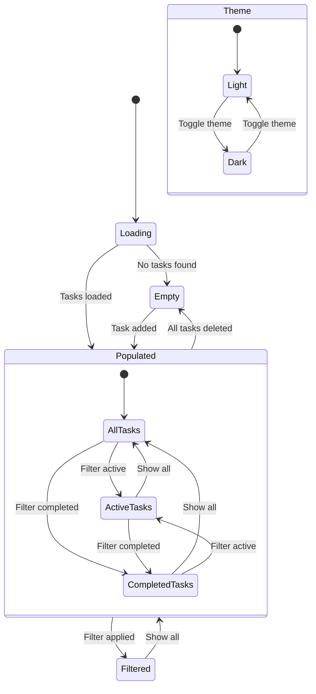

---

## 🔄 PWA Architecture

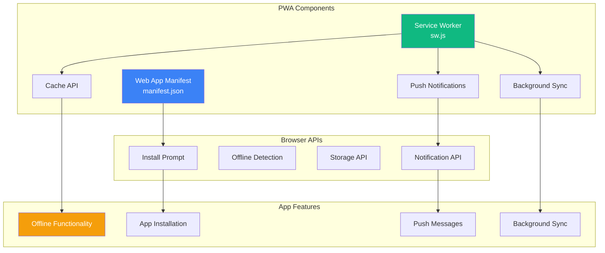

---

## 📱 Responsive Design Breakpoints

```
Mobile First Approach:

┌─────────────────────────────────────────────────────────────────┐
│                     Breakpoint Strategy                        │
├─────────────────────────────────────────────────────────────────┤
│ 320px+  │ Mobile Portrait  │ Single column, stacked layout   │
│ 480px+  │ Mobile Landscape │ Slightly wider, same layout     │
│ 768px+  │ Tablet Portrait  │ Two-column in some sections     │
│ 1024px+ │ Tablet Landscape │ Full desktop layout starts     │
│ 1280px+ │ Desktop          │ Centered layout, max-width      │
└─────────────────────────────────────────────────────────────────┘

Layout Adaptations:

Mobile (320px-767px):
┌─────────────────┐
│     Header      │
├─────────────────┤
│   Task Input    │
├─────────────────┤
│  Filter Buttons │
│  (Stacked)      │
├─────────────────┤
│   Task List     │
│   (Full width)  │
├─────────────────┤
│  Bulk Actions   │
│  (Stacked)      │
├─────────────────┤
│     Footer      │
└─────────────────┘

Tablet/Desktop (768px+):
┌─────────────────────────────────┐
│           Header                │
├─────────────────────────────────┤
│         Task Input              │
├─────────────────────────────────┤
│      Filter Buttons (Row)       │
├─────────────────────────────────┤
│         Task List               │
│       (Centered, Max-width)     │
├─────────────────────────────────┤
│     Bulk Actions (Row)          │
├─────────────────────────────────┤
│           Footer                │
└─────────────────────────────────┘
```

---

## 🧪 Testing Strategy Overview

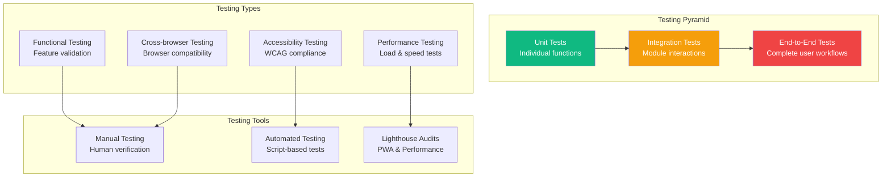

---

## 🚀 Deployment Architecture

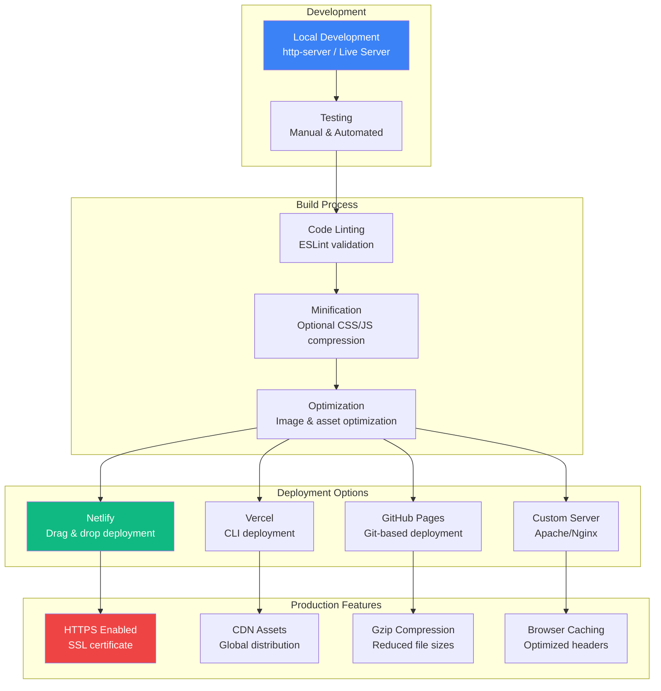

---

## 🔧 Error Handling Flow

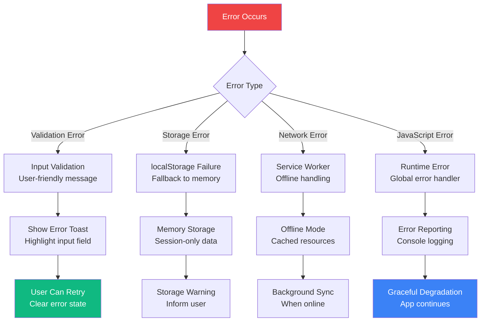

---

## 📊 Performance Metrics Dashboard

```
Performance Monitoring Points:

┌─────────────────────────────────────────────────────────────────┐
│                    Core Web Vitals                             │
├─────────────────────────────────────────────────────────────────┤
│ LCP (Largest Contentful Paint)  │ < 2.5s    │ Page load speed │
│ FID (First Input Delay)         │ < 100ms   │ Interactivity   │
│ CLS (Cumulative Layout Shift)   │ < 0.1     │ Visual stability│
├─────────────────────────────────────────────────────────────────┤
│                 Additional Metrics                              │
├─────────────────────────────────────────────────────────────────┤
│ TTI (Time to Interactive)       │ < 3.8s    │ App readiness   │
│ Speed Index                     │ < 3.4s    │ Visual progress │
│ First Contentful Paint          │ < 1.8s    │ Initial render  │
├─────────────────────────────────────────────────────────────────┤
│               Bundle Size Targets                               │
├─────────────────────────────────────────────────────────────────┤
│ Total JavaScript                │ < 50KB    │ Uncompressed    │
│ Total CSS                       │ < 30KB    │ Uncompressed    │
│ Critical Path Resources         │ < 14KB    │ Above-the-fold  │
└─────────────────────────────────────────────────────────────────┘

Memory Usage Tracking:

Application State: ~1-5KB
DOM Elements: ~10-50KB (depending on task count)
Event Listeners: ~1KB
Cache Storage: ~100KB-1MB (Service Worker cache)
localStorage: ~10-100KB (task data)
```

---

This comprehensive set of architecture diagrams provides visual representations of all key aspects of the TaskFlow Lite application, from high-level system architecture to detailed event flows and performance considerations. These diagrams complement the technical documentation and help developers understand the application's structure and behavior patterns.
